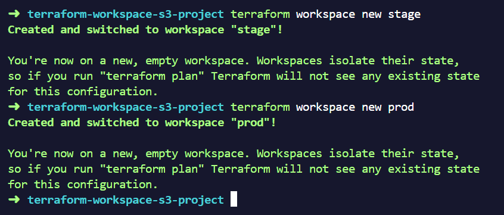
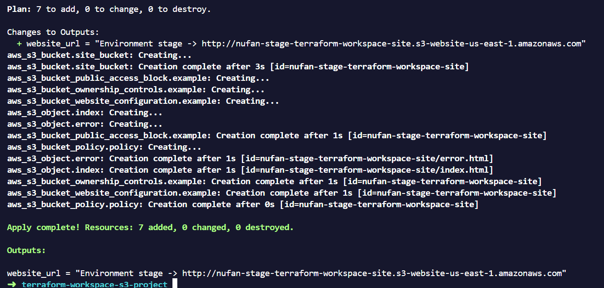
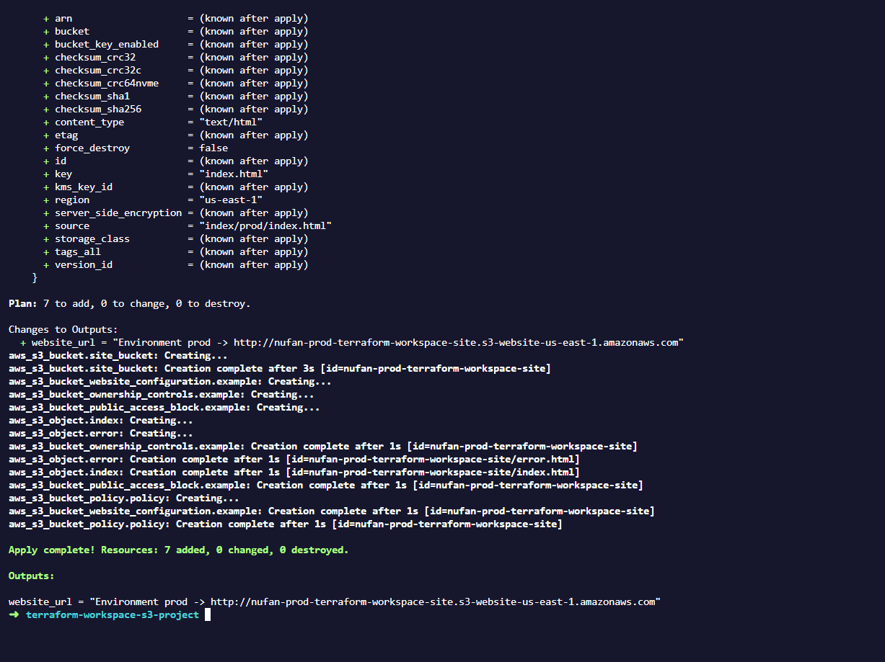
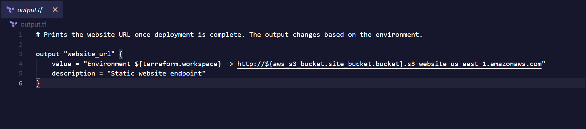
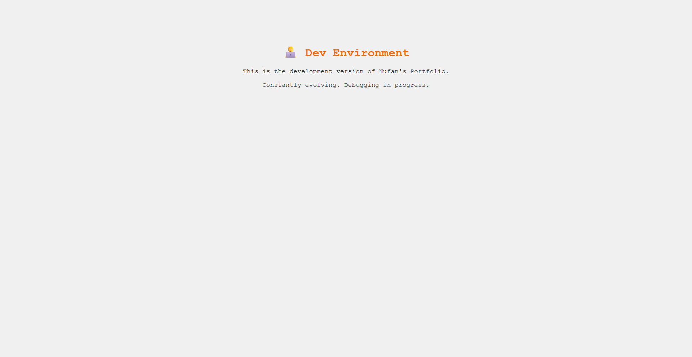
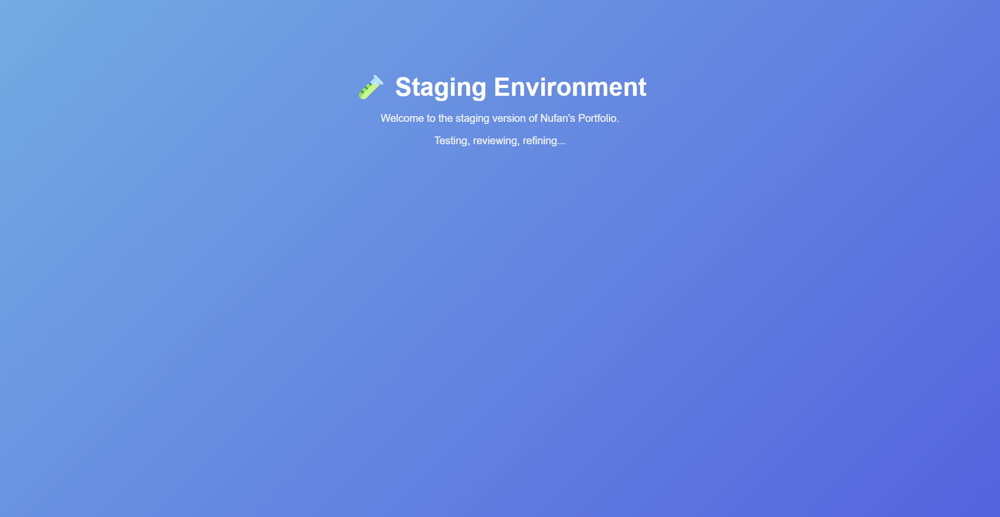
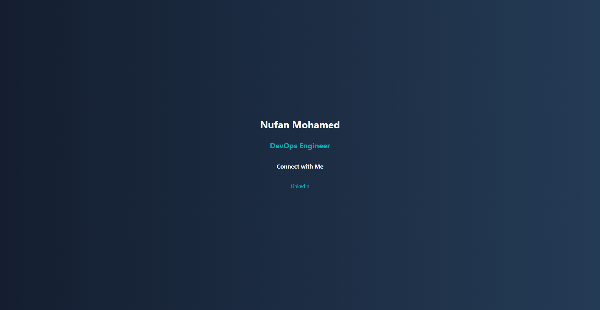

# Terraform Workspace S3 Project

This project demonstrates the use of **Terraform Workspaces** to manage **multi-environment deployments (Dev, Stage, Prod)** using a single Terraform configuration. Each workspace provisions an **AWS S3 bucket** and hosts a **static website** with environment-specific content.

---

## Overview

Terraform Workspaces enable environment isolation without duplicating configuration files.
In this project:

* Each workspace represents a separate environment
* A unique S3 bucket is created per environment
* Each environment serves its own static website

### Example Bucket Names

```
nufan-dev-terraform-workspace-site
nufan-stage-terraform-workspace-site
nufan-prod-terraform-workspace-site
```

Each environment includes a distinct `index.html` file to clearly indicate the active workspace.

---

## Project Structure

```
terraform-workspace-s3/
├── main.tf        # S3 bucket and static website configuration
├── provider.tf    # AWS provider and region configuration
├── output.tf      # Outputs website URLs per environment
├── create.sh      # Automates workspace creation and deployment
├── delete.sh      # Destroys workspaces and cleans up resources
│
└── index/
    ├── dev/index.html
    ├── stage/index.html
    └── prod/index.html
```

---

## Prerequisites

Ensure the following are installed and configured:

* **AWS CLI** with credentials for an IAM user that has S3 access
* **Terraform CLI** (v1.3+ recommended)

---

## How to Run

Clone the repository and navigate into the project directory:

```bash
git clone https://github.com/NufanNoushad/terraform-workspace-s3.git
cd terraform-workspace-s3
```

Make the deployment script executable and run it:

```bash
chmod +x create.sh
./create.sh
```

### What the script does

* Creates Terraform workspaces (`dev`, `stage`, `prod`)
* Deploys a static website to AWS S3 for each workspace
* Outputs the S3 website URLs

You can open the generated URLs in a browser to verify each environment.

---

## Deployment Evidence

These screenshots capture the workspace lifecycle and confirm that each environment is isolated and deployed correctly.

### 1) Workspace creation



### 2) Terraform apply output (example)




### 3) Output value changes by workspace



### 4) Environment-specific websites






## Clean Up

To avoid unnecessary AWS costs, destroy all resources after testing:

```bash
chmod +x delete.sh
./delete.sh
```

This will remove:

* All created S3 buckets
* Uploaded website files
* Associated Terraform workspaces

---

## Conclusion

This project provides a practical, real-world example of managing **multi-environment infrastructure** using Terraform Workspaces. It serves as a solid foundation for learning Infrastructure as Code, AWS S3 automation, and environment-based deployment strategies.


